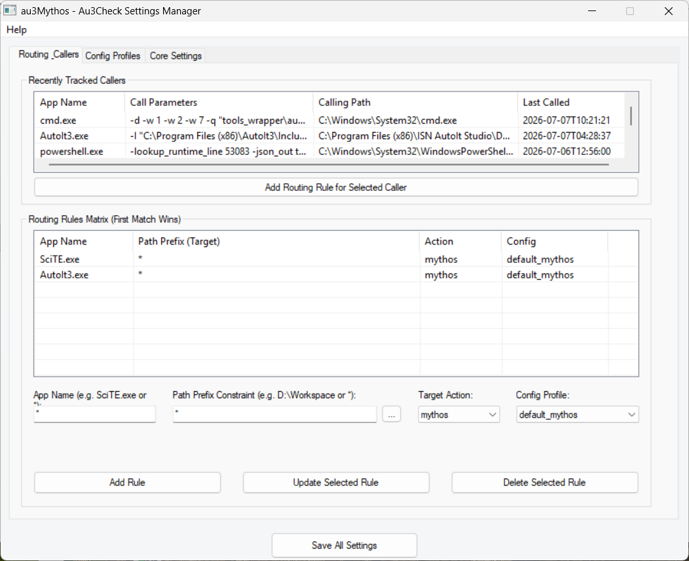

<p align="center">
  
</p>

<h1 align="center">au3Mythos</h1>

<p align="center">
  <strong>General Static Scoping Analyzer & Compiler Toolchain</strong>
</p>

<p align="center">
  <em>"Quality is the planned and reproducible result of discipline, ambition, and passionate diligence."</em><br>
  <em>„Qualität ist das geplante und reproduzierbare Ergebnis von Disziplin, Ehrgeiz und leidenschaftlichem Fleiß.“</em>
</p>

<p align="center">...</p>

<p align="center">
  <em>"Errors and warnings are not footnotes."</em><br>
  <em>„Errors und Warnings sind keine Fußnoten.“</em>
</p>

---

### Major Update (v1.2.0)

* **False-Positive Hardening**: Robust refinements implemented based on detailed reports and test cases contributed by AspirinJunkie.
* **Scoping Heuristics & Terminal Branches**: Complete resolution of cases A–J alongside path-sensitive variable declaration checks (e.g. `Local $iErr` in `JSON.au3` terminal branches).
* **Encoding-Safe Source Parsing**: Enhanced file reading with native support for UTF-8 (with/without BOM), UTF-16 (LE/BE), and ANSI sources to prevent decoding issues.
* **Expanded Test Suite**: Additional regression tests establishing complete counter-fixture parity.
* **Performance Optimizations**: A measured runtime reduction of **8.93%** across comprehensive includes.
* **Advanced Diagnostics**: In-place deep JSON analysis and runtime line-mapping features for locating execution errors in consolidated preprocessed files.

---

This project is built for everyone who recognizes the critical importance of quality and code hygiene—those who are ready to step it up and go the extra mile that makes the difference between *"it works"* and *"it works stably and cleanly under all foreseeable scenarios."*

---

## Inspiration

*When news broke in recent weeks about Anthropic's 'Mythos' LLM model—hailed for its outstanding capabilities in analyzing software and identifying vulnerabilities, causing a wave of astonishment, excitement, fear, and panic across the software industry—it got me thinking. Most programming errors do not require artificial intelligence to be uncovered. They simply require a sharp mind capable of translating common sources of error into a codebase using static and heuristic patterns. It costs diligence, brainpower, and time—but zero tokens. So, I built it.*

> **Hintergrund**
> Als in den vergangenen Wochen die Meldungen durch alle Medien gingen, dass Anthropic ein sogenanntes „Mythos“ LLM-Modell geschaffen hat, welches überragende Leistungen in der Analyse, Fehler- und Schwachstellensuche von Software zeigt – und das allgemeine Echo der Fachwelt von Erstaunen, Jubel, Furcht und Panik durchzogen war – dachte ich mir: Für die meisten Fehler braucht es keine künstliche Intelligenz. Es braucht einen scharfen Verstand, der in der Lage ist, die üblichen Fehlerquellen in statischer und heuristischer Weise in Programmcode zu gießen. Das kostet Fleiß, Hirnschmalz und Zeit – aber keine Tokens. Also habe ich es getan.

### Target Audience / Zielgruppe

*The Mythos Syntax Checker and Code Analyzer is designed for all developers who have the ambition to challenge and elevate the quality of their software in a constructive, goal-oriented, and pragmatic manner. Of course, everyone is also welcome who is simply curious, wants to explore static code analysis, or is looking for a lightweight, educational approach.*

> Der Syntax Checker und Code Analyzer Mythos ist für alle Entwickler gedacht, die den Ehrgeiz haben, den Anspruch an die Qualität ihrer Software konstruktiv, zielorientiert und pragmatisch zu hinterfragen. Natürlich sind auch alle willkommen, die einfach nur neugierig sind, sich mit statischer Codeanalyse befassen oder einen schlanken Lernansatz suchen.

---

## Purpose & Architecture

**au3Mythos** is a general-purpose, highly advanced Syntax Checker and Code Analyzer designed to trace lexical scoping, block-level definitions, and dead-stores across BASIC-like programming languages and interpreters. 

The toolchain is architected to support multiple target platforms. It currently ships with a production-hardened module tailored specifically for **AutoIt 3** (`autoit_windows_x64`). Extending the scoping engine to support other similar BASIC-like scripting dialects and interpreters is a core planned capability.

The AutoIt-specific scoping engine (`autoit_windows_x64_scoping_analyzer.py`) preprocesses AutoIt entry files, recursively resolves complex include trees, handles continuation blocks, maps generated code coordinates back to original files, and reports critical scoping warnings that traditional checkers often miss. It focuses on runtime-sensitive patterns such as conditional declarations, unsafe map/array/object dereferencing, stale `@error` checks, array dimension mistakes, and include-scope problems.

## Usage

```powershell
$env:PYTHONPATH = ".\src"
python -m autoit_static_analyzer <main_source_file.au3> `
  --include-dirs "dir1,dir2" `
  --out-dir "temp_scoping_analysis"
```

System AutoIt includes are analyzed and reported by default. To suppress warnings originating from the standard AutoIt include directory while still using those files as analysis context:

```powershell
python -m autoit_static_analyzer <main_source_file.au3> --skip-system-includes
```

Additional semantic inspections can be enabled explicitly while they are being hardened against false positives in large include trees:

```powershell
python -m autoit_static_analyzer <main_source_file.au3> --enable-experimental-checks
```

The analyzer writes:

- `preprocessed_source.au3`
- `scoping_report.md`

## Example

For the AutoIt standard include burn-in:

```powershell
.\examples\run_burnin_analysis.ps1
```

The current verified burn-in baseline is documented in `docs/burnin_baseline.md`.

## Checks

- Include preprocessing with `#include-once` handling.
- String-aware comment handling, including semicolons inside strings.
- Continuation-line merging with original file/line mappings.
- Function-local declaration and reference tracking.
- `Global`, `Dim`, `Static`, `Static Local`, and `Global Enum` indexing.
- Branch, loop, repeated-guard, and `ReDim` visibility heuristics.
- Array dimension and literal bounds checks.
- Known dynamic array/map return recognition, including JSON, WinHTTP, WinAPI, project map factories, and selected AutoIt builtins.
- Unsafe return dereference checks for arrays, maps, and objects.
- Conservative `@error` freshness checks for the short pattern `primary call -> intervening call -> @error`, while ignoring nested utility calls inside the primary call expression and longer ambiguous windows.
- AutoIt block comment skipping for `#cs`/`#ce` and `#comments-start`/`#comments-end`.

## Warning Types

- `Block Scoping Bug`
- `Reference Before Declaration`
- `Undeclared Variable`
- `Global Scope Violation`
- `Constant Assignment Violation`
- `Array Dimension Mismatch`
- `Array Subscript Out of Bounds`
- `Unsafe Return Dereference`
- `Overwritten @error Check`

Experimental warning types, enabled only with `--enable-experimental-checks`:

- `Unchecked SetError Return`
- `Overwritten @extended Check`
- `Suspicious UBound Dimension`
- `ReDim Dimension Change`
- `Unchecked Array Result Index`
- `Unchecked Map Key`
- `Unsafe Object Dereference`
- `DllCall Return Index Mismatch`
- `Handle Leak on Return`
- `Nested Loop Variable Reuse`
- `Unreachable Code`
- `Potential Uninitialized Use`
- `Implicit Empty String Use`
- `Enum Value Collision`
- `Potential Numeric Coercion`
- `Array Used as Boolean`

## Project Layout

```text
AutoIt_Static_Analyzer/
  README.md
  LICENSE
  pyproject.toml
  project.json
  build.ps1
  backup.ps1
  bump.ps1
  release.ps1
  CHANGELOG.md
  Doxyfile
  .gitignore
  .editorconfig
  .gitattributes
  src/
    autoit_static_analyzer/
      __init__.py
      __main__.py
      autoit_windows_x64_scoping_analyzer.py
  tools_installer/
    Setup_au3Mythos_x64.au3
    Uninstall_au3Mythos_x64.au3
  tools_wrapper/
    Au3Check_Wrapper.au3
    au3Mythos_Settings.au3
  resources/
    mythos_logo.ico
  examples/
    run_burnin_analysis.ps1
  tests/
    all_system_includes.au3
    test_warning_fixtures.py
    test_lexer_helpers.py
    test_installer_e2e.py
```

The package entry point lives under `src/autoit_static_analyzer/`.

## Installation

A professional Setup and Uninstaller is provided inside release distribution builds:

* **Graphical Installation**: Run the compiled `Setup_au3Mythos_x64.exe` as Administrator to select a custom folder (default: `C:\Program Files\au3Mythos`), create Start Menu shortcuts, and register au3Mythos in the Windows **Apps & Features (Add/Remove Programs)** panel.
* **Silent Installation**: Run via command-line:
  ```powershell
  .\Setup_au3Mythos_x64.exe /S /DIR="C:\Path\To\Install"
  ```
* **Clean Uninstallation**: Can be triggered directly from the Windows **Apps & Features** control panel, or by running:
  ```powershell
  C:\Path\To\Install\Uninstall_au3Mythos_x64.exe /S
  ```
  The uninstaller automatically rolls back any active compiler wrapper integrations (restoring standard compiler binaries) before performing full directory and registry cleanup.

### Drop-in Interception & Settings Manager

Once installed, **au3Mythos** integrates seamlessly with your existing development workflow:
1. **Drop-in Wrapper**: The compiled `Au3Check_Wrapper_x64.exe` is copied over the original `Au3Check.exe` in your AutoIt3 installation folder (with a backup of the original automatically preserved as `Au3Check_Original.exe`).
2. **Seamless Routing**: Whenever an editor (such as SciTE or VS Code) initiates a syntax check, the wrapper intercepts the call, analyzes the calling process and the file directory tree, and routes the code to either the advanced **au3Mythos Scoping Analyzer** or the original checker according to your routing rules.
3. **Settings GUI**: The **au3Mythos Settings Manager** (`au3Mythos_Settings_x64.exe`) provides an elegant Win32 graphical interface to manage routing rules, edit diagnostic configurations, and toggle the interception on or off.

<p align="center">
  
</p>

## Validation

Quick syntax check:

```powershell
$env:PYTHONDONTWRITEBYTECODE = "1"
python -c "import ast, pathlib; ast.parse(pathlib.Path('src/autoit_static_analyzer/autoit_windows_x64_scoping_analyzer.py').read_text(encoding='utf-8'))"
```

Run tests:

```powershell
python .\tests\test_lexer_helpers.py
python .\tests\test_warning_fixtures.py
```

The fixture tests generate small AutoIt programs for analyzer-only warning classes, run `Au3Check.exe` in strict mode (`-d -w 1 ... -w 7 -q`) and require zero errors and zero warnings before asserting the analyzer finding. They also include clean counter-fixtures for the same warning families to guard against false-positive regressions. Warning classes already covered by Au3Check are kept in a separate overlap test group so they are not misrepresented as Au3Check-blind cases.

`tests/test_warning_fixtures.py` also contains `AU3CHECK_BLIND_CANDIDATE_FIXTURES`: small, strict-clean AutoIt examples for additional semantic bug classes. These fixtures run the analyzer with `--enable-experimental-checks` and verify the exact warning type for stale `@extended`, unchecked `SetError` return paths, map-key reads without `MapExists`, unchecked `StringSplit`/`StringRegExp` payload indexes, DllCall signature/index mismatches, handle lifecycle leaks, missing branch initialization, dead code, enum value collisions, silent numeric coercion, and array/map/object values used as Boolean conditions.

Run the standard build checks:

```powershell
.\build.ps1
```

`build.ps1` also generates Doxygen HTML documentation under `docs/doxygen/html`.

Run build checks plus the burn-in system includes analysis:

```powershell
.\build.ps1 -RunBurninSmoke
```

Create a timestamped backup zip under the workspace parent folder `_Backups`:

```powershell
.\backup.ps1
```

Bump the project version in `project.json`, `pyproject.toml`, `src/autoit_static_analyzer/__init__.py`, and `Doxyfile`:

```powershell
.\bump.ps1 patch
.\bump.ps1 minor
.\bump.ps1 major
.\bump.ps1 set 0.2.0
```

Show CLI help from the package:

```powershell
$env:PYTHONPATH = ".\src"
python -m autoit_static_analyzer --help
```

---

## Disclaimer / Haftungsausschluss

*Disclaimer: This project is an independent, standalone open-source software suite. It is in no way affiliated with, associated with, sponsored by, or endorsed by the original author(s) of the AutoIt 3 Au3Check utility or the AutoIt team.*

> **Haftungsausschluss**
> Dieses Projekt ist eine eigenständige und unabhängige Open-Source-Software. Es steht in keinerlei Verbindung, Assoziation, Sponsorenschaft oder geschäftlicher Beziehung mit dem originalen Autor der Au3Check-Software oder dem AutoIt-Entwicklerteam.


