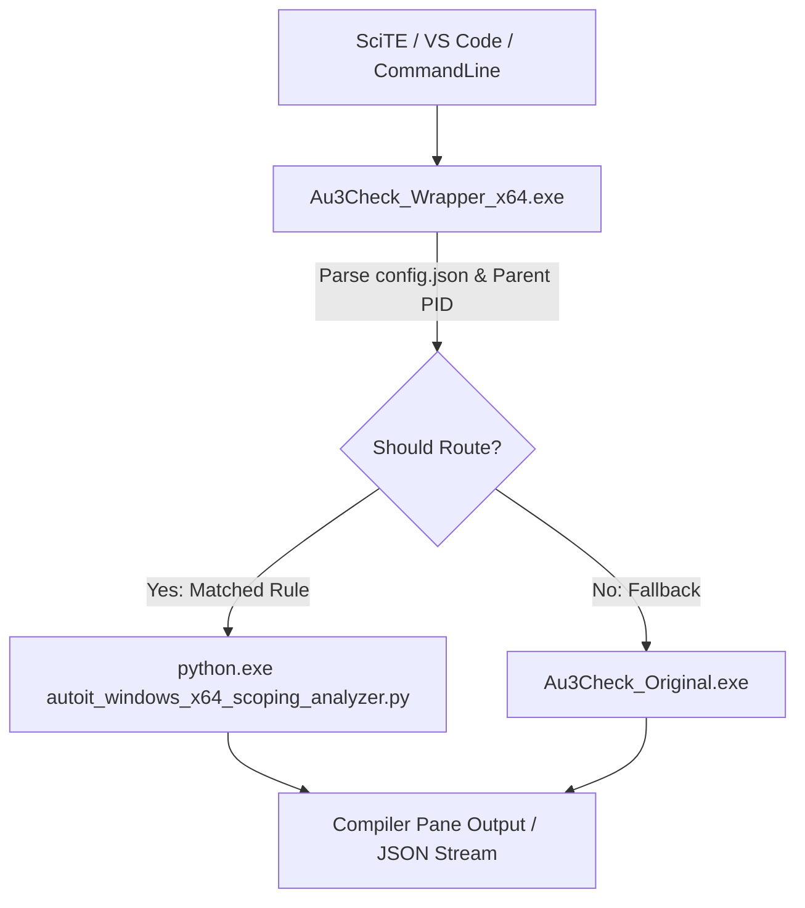

# au3Mythos - Technical Reference, Architecture & API

**au3Mythos** is a general-purpose static analysis framework designed to inspect scoping boundaries, variable lifecycles, and syntactical constructs of BASIC-like scripting dialects. It includes a modular design, currently featuring a production-hardened target engine for AutoIt 3 (`autoit_windows_x64`).

This document provides technical reference specifications for the architecture, configuration schemas, command-line interfaces, and APIs.

---

## 1. Toolchain Architecture

The software consists of three decoupled components:



### 1.1 The Static Scoping Analyzer (`autoit_windows_x64_scoping_analyzer.py`)
* **Location**: [autoit_windows_x64_scoping_analyzer.py](../src/autoit_static_analyzer/autoit_windows_x64_scoping_analyzer.py)
* **Description**: A Python 3.x static diagnostic parser. It preprocesses the main source file (resolving recursively all `#include` targets, handling comments and continuation blocks), builds a lexical block AST, tracks variable scopes (nested block scoping), and audits variables for common runtime failures.

### 1.2 The CLI Wrapper (`Au3Check_Wrapper_x64.exe`)
* **Source**: [Au3Check_Wrapper.au3](../tools_wrapper/Au3Check_Wrapper.au3)
* **Compiled**: `bin\Au3Check_Wrapper_x64.exe` (x64 Console Application)
* **Description**: Invoked by editors as a drop-in replacement for the standard check executable. It identifies callers using Win32 API snapshots, matches the execution path against `config.json` rules, and forwards stream pipes (Stdin/Stdout/Stderr) to either `au3Mythos` or the original `Au3Check_Original.exe`.

### 1.3 The Settings GUI (`au3Mythos_Settings_x64.exe`)
* **Source**: [au3Mythos_Settings.au3](../tools_wrapper/au3Mythos_Settings.au3)
* **Compiled**: `bin\au3Mythos_Settings_x64.exe` (x64 GUI UAC admin application)
* **Description**: Provides Rule management (CRUD operations) and settings administration. It automates installation by backing up standard check executables and swapping the wrapper in place.

---

## 2. Command-Line Options & Mapping Layer

When run in legacy compatibility mode (triggered by the presence of standard check options), `au3Mythos` preprocesses inputs and mimics standard output conventions:

| Option | Description | Support Status | Behavior in au3Mythos |
| :--- | :--- | :---: | :--- |
| `-q` | Quiet Mode | **Yes** | Suppresses progress output, showing only errors and warnings. |
| `-d` | Enforce declarations | **Yes** | Enforced by default; flags any undeclared variable read/write. |
| `-I dir` | Include search folder | **Yes** | Appends `dir` to search paths for `#include` resolution. |
| `-w 1` | Duplicate includes | **Yes** | Warns if a file is included multiple times without having `#include-once`. |
| `-w 2` | Missing comments-end | **Yes** | Warns if the source ends inside an unclosed comment block. |
| `-w 3` | Duplicate declarations | **Yes** | Warns if a variable is declared twice in the same scope. |
| `-w 4` | Local in global scope | **Yes** | Warns if local variables leak or are referenced in global scope. |
| `-w 5` | Unused local variables | **Yes** | Warns if a local variable is declared in a function but never used. |
| `-w 6` | Deprecated `Dim` usage | **Yes** | Warns when a variable is declared using `Dim`. |
| `-w 7` | ByRef const passing | **Yes** | Warns if constant variables or expressions are passed to `ByRef` parameters. |

---

## 3. Configuration System (`config.json`)

The routing matrix is configured via `config.json` located in the active wrapper directory:

```json
{
  "wrapper_enabled": true,
  "rules": [
    {
      "caller_name": "SciTE.exe",
      "path_prefix": "D:\\AIWorkspace",
      "action": "mythos",
      "config": "default_mythos"
    },
    {
      "caller_name": "*",
      "path_prefix": "*",
      "action": "original",
      "config": "default_original"
    }
  ],
  "configs": {
    "default_mythos": {
      "type": "mythos",
      "python_path": "python.exe",
      "analyzer_path": "",
      "skip_system_includes": false,
      "enable_experimental_checks": true,
      "engine_mode": "standalone",
      "no_auto_include_discovery": false,
      "enable_system_dead_stores": true,
      "warnings": {
        "1": true,
        "2": true,
        "3": true,
        "4": true,
        "5": true,
        "6": true,
        "7": true
      }
    },
    "default_original": {
      "type": "original",
      "extra_args": "-d -w 1 -w 2 -w 7 -q",
      "override_args": false
    }
  }
}
```

* **`caller_name`**: The process name of the parent executable (e.g. `SciTE.exe`, `Code.exe` for VS Code, or `*` wildcard).
* **`path_prefix`**: The file path prefix of the source being checked.
* **`action`**: Can be `"mythos"` (executes our static scoping analyzer) or `"original"` (delegates to the original syntax checker).
* **`config`**: Maps to a defined profile key in the `"configs"` table.

---

## 4. Modern APIs & Advanced Modes

### 4.1 Unified JSON Output Mode (`-json_out`)
Passing the `-json_out` flag forces the toolchain (both wrapper and scoping analyzer) to format all diagnostics as a single JSON array printed directly to stdout:

```json
[
  {
    "file": "D:/Project/Main.au3",
    "line": 45,
    "col": 12,
    "level": "warning",
    "warning_id": 4,
    "message": "Local variable '$sVal' declared in global scope.",
    "details": {
      "declared_at": "D:/Project/Main.au3:45"
    }
  }
]
```

#### Enrichment Metadata
* **Duplicate declarations (ID 3)**: Contains `"original_declaration"` pointing to the first declaration coordinates.
* **Block scoping bugs (ID 4)**: Contains `"declaration"` coordinates and the active `"block_range"` bounds (e.g., `lines 10-18`).
* **Undeclared variables**: Computes Levenshtein distance ($\le 2$) against all active symbols and lists matching variables in a `"suggestions"` array.

### 4.2 Runtime Line Lookup (`-lookup_runtime_line <line_num>`)
Inspects combined compiled line offsets and maps them back to developer source coordinates.
* Output plain text or JSON (when combined with `-json_out`).
* Example JSON return:
```json
{
  "preprocessed_line": 2451,
  "file": "D:/Project/DatabaseHelper.au3",
  "line": 42,
  "code": "Local $sVal = $aData[$iIndex][3]"
}
```

---

## 5. Testing & Quality Assurance

The framework includes dedicated validation runners executed during build verification:
* **[test_lexer_helpers.py](../tests/test_lexer_helpers.py)**: Validates tokenizer splitting, expression continuation, and function-signature parsing behavior.
* **[test_warning_fixtures.py](../tests/test_warning_fixtures.py)**: Runs regression cases covering block scoping checks, legacy check warnings, and experimental inspection categories.
* **[test_wrapper_e2e.py](../tests/test_wrapper_e2e.py)**: Performs e2e tests validating the intercept routing wrapper, config parser, stream pipes forwarding, and return codes propagation.
