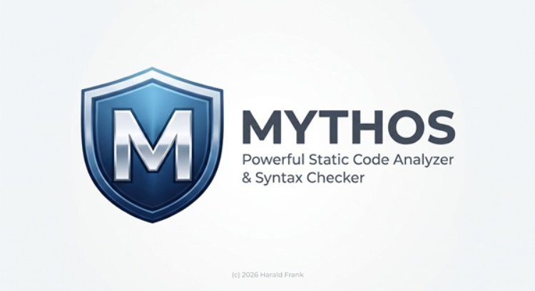
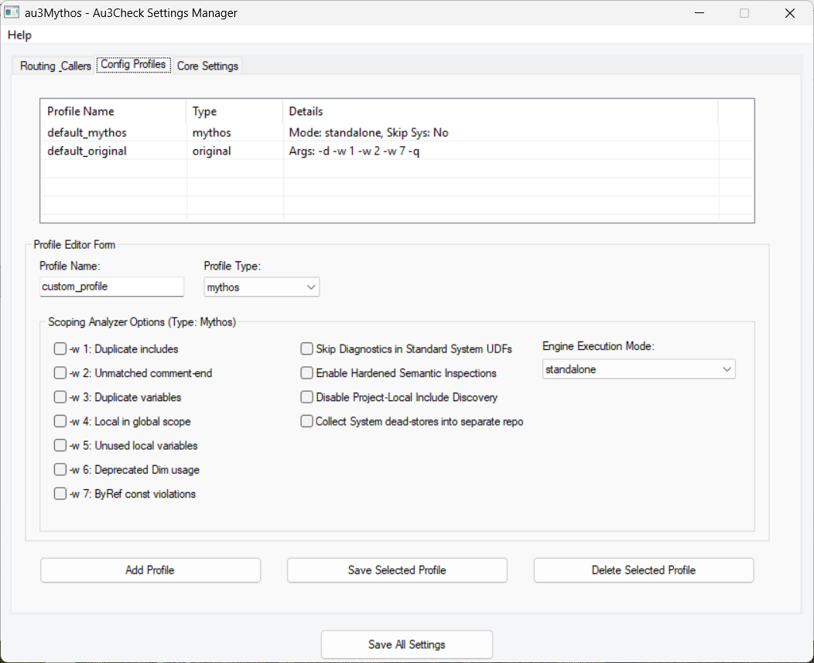
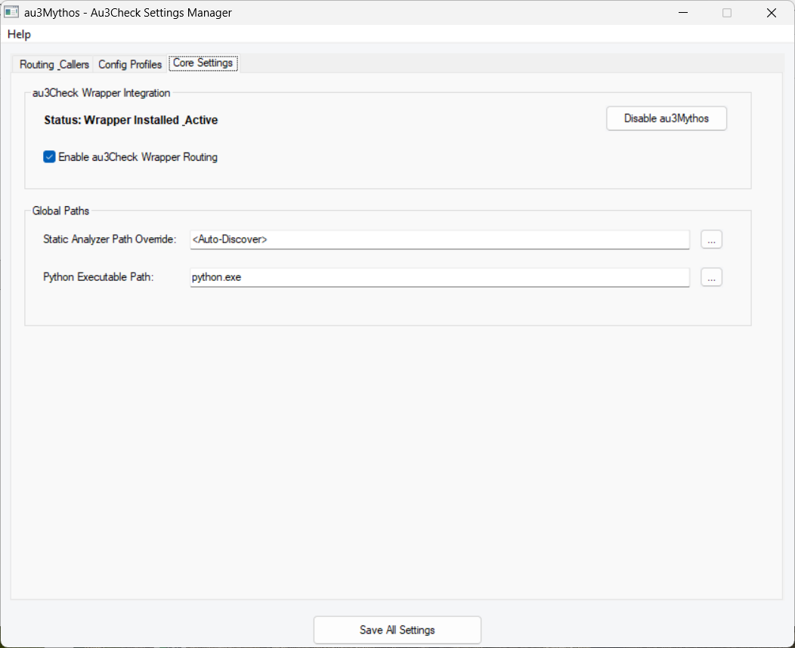
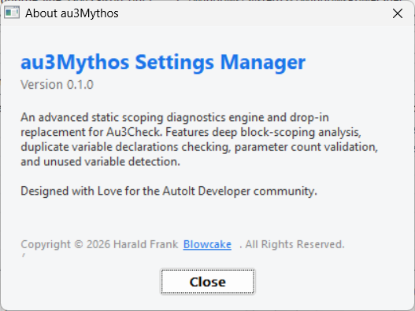

# au3Mythos - User Manual & Settings Guide

Welcome to the **au3Mythos Settings Manager** documentation. 

The **au3Mythos** framework provides a general-purpose, highly advanced Syntax Checker and Code Analyzer. It is designed to trace lexical scoping, block-level definitions, and dead-stores across BASIC-like programming languages. This Settings Guide details how to install, configure, and use the au3Check intercept routing wrapper and the production-hardened **AutoIt 3** diagnostic engine module (`autoit_windows_x64`). Expanding the tools to target other dialects and platforms is planned.

---

## 1. Startup Splash Screen

When you launch the Settings Manager (`au3Mythos_Settings_x64.exe`), you are greeted with the brand-identity startup splash screen:

This splash screen remains visible for 1.5 seconds while background components initialize, then automatically transitions into the main user interface.

---

## 2. Routing & Callers (Tab 1)

The **Routing & Callers** tab lets you define how compile-time and syntax-checking requests from various editors (such as SciTE, VS Code, or command-line calls) are intercepted and routed.

### 2.1 How Interception Works
The au3Mythos wrapper acts as a drop-in replacement for the standard `Au3Check.exe` compiler. When an editor triggers a syntax check, the wrapper intercepts the command line arguments and inspects:
1. **The parent process executable name** (e.g. `SciTE.exe`, `code.exe`, `cmd.exe`).
2. **The directory path prefix of the source file** being checked.

Based on these two parameters, it scans your active routing rules from top to bottom. The first rule that matches will determine how the file is analyzed.

### 2.2 Detailed Controls & Form Fields

#### Recently Tracked Callers (Top Group)
This list view displays calls that were recently intercepted by the au3Check wrapper in the background. It is populated in real-time as you trigger syntax checks in your editors.
* **App Name**: The calling executable name (e.g. `SciTE.exe`).
* **Call Parameters**: The exact command-line arguments sent by the editor.
* **Calling Path**: The directory from which the source file was checked.
* **Last Called**: The timestamp of the check.
* **Add Routing Rule for Selected Caller (Button)**: Copies the selected caller's application name and calling path directly into the rule form below for rapid rule creation.

#### Routing Rules Matrix (Middle Group)
Displays all currently configured routing rules in their priority order (first match wins).
* **App Name**: The calling executable name (e.g., `SciTE.exe` or `*` to match any caller).
* **Path Prefix (Target)**: The directory prefix constraints (e.g., `D:\Workspace` or `*` to match any path).
* **Action**: Displays the action type (`mythos` for scoping analyzer, `original` for the standard legacy check).
* **Config**: The configuration profile mapped to this routing rule.

#### Rule Inline Form Controls (Bottom Panel)
Used to add, update, or delete routing rules.
* **App Name (Input)**: Enter the exact executable filename of the caller (e.g., `SciTE.exe`). Use `*` to apply the rule to all callers.
* **Path Prefix Constraint (Input)**: Enter the absolute path prefix. The rule will only trigger for files residing under this directory tree. Use `*` to apply the rule to files in any directory.
* **Browse Button (`...`)**: Opens a folder picker dialog to select the path prefix constraint.
* **Target Action (Dropdown)**:
  * `mythos`: Directs the intercepted code to the static scoping analyzer.
  * `original`: Bypasses scoping checks and runs the original `Au3Check.exe`.
* **Config Profile (Dropdown)**: Lists all available configuration profiles (e.g., `default_mythos`, `default_original`, or custom profiles) to apply to this rule.
* **Add Rule (Button)**: Appends a new rule to the rules matrix using the values entered in the form fields.
* **Update Selected Rule (Button)**: Overwrites the selected rule in the rules matrix with the current form field values.
* **Delete Selected Rule (Button)**: Removes the selected rule from the rules matrix.

---

### 2.3 Step-by-Step: Creating a Rule from Recently Tracked Callers

Rather than manually entering paths and executable names, you can automatically convert any intercepted compiler call into a permanent routing rule. Follow these steps:

1. **Trigger a Tracked Call**: Run a compile or syntax check as usual from your editor (e.g., press `Ctrl+F7` in SciTE, or save in VS Code). The au3Check wrapper will intercept the call in the background and log it.
2. **Select the Caller**: Open the Settings Manager GUI. In the top table **Recently Tracked Callers**, select the row corresponding to your recent check.
3. **Populate the Form**: Click the **Add Routing Rule for Selected Caller** button. The GUI will automatically copy the caller's executable name (e.g., `SciTE.exe`) into the **App Name** field, and the caller's directory path (e.g., `D:\Workspace\MyProject`) into the **Path Prefix Constraint** field.
4. **Choose Action & Profile**:
   * Set **Target Action** to `mythos` (to run the static scoping analyzer) or `original` (to fall back to the standard compiler checks).
   * Select the desired configuration profile in the **Config Profile** dropdown.
5. **Add to Matrix**: Click the **Add Rule** button. The rule will immediately appear in the **Routing Rules Matrix** table.
6. **Save Changes**: Click the global **Save All Settings** button at the bottom of the window to write the new rule to the configuration file (`config.json`) and apply it permanently.

---

## 3. Config Profiles (Tab 2)

The **Config Profiles** tab defines the warning configurations, skip options, and engine execution modes for both the scoping analyzer and the standard fallback compiler.

### 3.1 Detailed Controls & Form Fields

#### Profiles List View (Top Panel)
Lists all available configuration profiles.
* **Profile Name**: The unique identifier of the profile.
* **Type**: The profile type (`mythos` or `original`).
* **Details**: A summary of active configuration parameters.

#### Profile Editor Form (Bottom Panel)
Configure warning parameters and analyzer modes.
* **Profile Name (Input)**: A unique name for the profile (e.g., `strict_scoping`).
* **Profile Type (Dropdown)**: Choose `mythos` (static scoping analyzer options) or `original` (standard `Au3Check` arguments). Selecting a type dynamically toggles the options panel below it.

#### Scoping Analyzer Options Panel (Type: Mythos)
Visible only when the profile type is set to `mythos`.
* **Checkboxes `-w 1` through `-w 7`**:
  * `-w 1: Duplicate includes`: Flags when the same file is included multiple times within the include tree.
  * `-w 2: Unmatched comment-end`: Flags unclosed multiline comment blocks (`#comments-start` / `#cs`).
  * `-w 3: Duplicate variables`: Flags duplicate global or local variable declarations within the same scope.
  * `-w 4: Local in global scope`: Flags variables declared using the `Local` keyword inside the global scope.
  * `-w 5: Unused local variables`: Flags local variables that are declared but never referenced.
  * `-w 6: Deprecated Dim usage`: Flags the use of the deprecated `Dim` declaration keyword.
  * `-w 7: ByRef const violations`: Flags assignment operations to `ByRef` parameters declared as `Const`.
* **Skip Diagnostics in Standard System UDFs (Checkbox)**: Passes the `--skip-system-includes` flag to suppress scoping warnings in standard AutoIt library files (while still using them as context).
* **Enable Hardened Semantic Inspections (Checkbox)**: Passes the `--enable-experimental-checks` flag to enforce strict scope auditing.
* **Disable Project-Local Include Discovery (Checkbox)**: Passes the `--no-auto-include` flag to prevent the analyzer from automatically discovering sibling include files in the project directory.
* **Collect System dead-stores into separate report (Checkbox)**: Passes the `--system-dead-stores` flag to output system library dead stores to a separate report, reducing clutter.
* **Engine Execution Mode (Dropdown)**:
  * `standalone`: Runs the precompiled static analyzer binary (`autoit_windows_x64_scoping_analyzer.exe`).
  * `python`: Runs the analyzer script directly using the configured Python interpreter (useful for development).

#### Original Checker Options Panel (Type: Original)
Visible only when the profile type is set to `original`.
* **Extra Arguments (Input)**: Custom compiler flags passed to `Au3Check_Original.exe` (e.g., `-d -w 1 -w 2 -w 7 -q`).
* **Override Caller Arguments completely (Checkbox)**: If checked, ignores the editor's command-line arguments and uses *only* the Extra Arguments plus the source file name.

#### Profile Buttons
* **Add Profile (Button)**: Saves the currently filled form as a new configuration profile.
* **Save Selected Profile (Button)**: Updates the selected profile in the list view with the form fields.
* **Delete Selected Profile (Button)**: Removes the selected profile. Note that default profiles (`default_mythos` and `default_original`) are locked and cannot be deleted.

---

## 4. Core Settings (Tab 3)

The **Core Settings** tab governs the wrapper installation status, global paths, and administrative integration.

### 4.1 Detailed Controls & Form Fields

#### au3Check Wrapper Integration Group
* **Status Label**: Indicates whether the wrapper is currently `Installed` (intercepting standard `Au3Check.exe` calls) or `Not Installed`.
* **Enable au3Mythos / Restore Au3Check (Button)**: Toggles the installation state. Since it replaces the standard executable in the program directory (usually under `C:\Program Files (x86)\AutoIt3\`), clicking this button prompts for administrative UAC elevation to perform the swap.
* **Enable au3Check Wrapper Routing (Checkbox)**: Globally toggles rule-based routing. If unchecked, all intercepted calls bypass rules and fallback directly to the original compiler.

#### Global Paths Group
Configure the engines used during execution.
* **Static Analyzer Path Override (Input)**: Specify the path to the scoping analyzer executable or python script (`autoit_windows_x64_scoping_analyzer.py` or `.exe`).
* **Browse Button (`...`)**: Opens a file picker dialog to locate the analyzer binary or script.
* **Python Executable Path (Input)**: Specify the path to the Python interpreter (required when running the analyzer in `python` mode).
* **Browse Button (`...`)**: Opens a file picker dialog to locate the Python executable (`python.exe`).

#### Global Actions (Visible globally at the bottom of the window)
* **Save All Settings (Button)**: Saves all settings, paths, custom config profiles, and routing rules to the `mythos_config/config.json` file. Clicking this is required after modifying any rule or profile to apply changes to subsequent compilation checks.

---

## 5. About Box

The **About** box displays the application version, licensing, and maintainer details:

You can access it at any time via the **Help -> About** menu selection.
